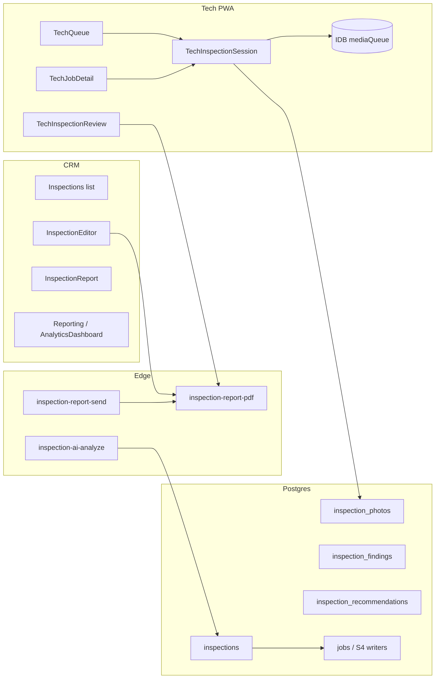

# ML-P1 Slice 8 — Architecture Findings (A0/A1)

| Field | Value |
| --- | --- |
| Planning base | `3cd9a32a03c07eda541daf75e28ddb0ec4aa27e2` |
| Disposition | Planning inventory — **no schema applied** |
| Depends on | S4 job execution · S5 invoices · S6 payments (closed) · existing Phase1/Phase5 inspections |

## 1. Current system map

## 2. Findings by pillar

### 2.1 Mobile Inspections

| Finding | Implication for S8 |
| --- | --- |
| Rich inspection surface already ships (CRM + tech stepper) | Prefer **evolve** over greenfield `/inspections` rewrite |
| No `inspection_items`; findings/recommendations exist | PD-S8-03: add checklist templates/responses rather than rename |
| Offline = photos only | PD-S8-02: harden queue; full CRDT sync is out unless Founder picks B |
| `inspection-sync` Edge missing | Only introduce if PD-S8-02 requires draft patch sync |
| S4 job completion is a separate writer path | Inspections must not silently complete jobs |

**Proposed A2 shapes (pending PD):**

- Tables: `inspection_checklist_templates`, `inspection_checklist_responses` (+ flag columns).  
- Edge (optional): `inspection-sync` batched upserts for draft fields + photo metadata.  
- RLS: mirror job assignment / tech ownership patterns already used by inspections.  
- Office: flag badges on list + job detail; filter by `safety` / `quality`.

### 2.2 Photo Bundles

| Finding | Implication |
| --- | --- |
| Inspection photos under `inspection-photos` bucket `…/inspections/…` | Keep; bundles get **job** prefix per Next-Phase |
| S4 job photos under `…/job-execution/…` | Bundle selector must read inspection + job-execution sources |
| PDF Edge exists for reports | Extend or add `photo-bundle-pdf` sibling; **no Stripe** |
| No album/reorder UI | New CRM/tech album component; ordered `photo_bundles` + `photo_bundle_items` |

**Proposed objects (pending PD):** `photo_bundles`, `photo_bundle_items`, Edge PDF, signed URL delivery for email/proposal attach (non-payment).

### 2.3 Analytics

| Finding | Implication |
| --- | --- |
| Client-side dashboard with stubs/hardcoded growth | Replace critical KPIs with read-only RPCs |
| No `ml_analytics_*` | Introduce under PD-S8-06 with SECURITY DEFINER + tenant assert, **SELECT-only** |
| Route `/crm/analytics` unwired | Register or clearly alias Reporting |

**Proposed metrics (read-only):**

- Ops: jobs by status / pipeline aging  
- Sales: quote→accepted→invoice funnel counts  
- Field: CO proposed/approved uptake rate  

Refresh: load-time + manual; cache optional later (Edge Config not required for A2 MVP).

### 2.4 Global UX / IA

| Finding | Implication |
| --- | --- |
| `BHFSidebar` groups Intake/Sales/Ops/Finance/Growth | Incremental reorder toward Hub → Jobs → Quotes → Inspections → Analytics → Settings |
| Settings default Billing tab | Keep; improve discoverability for Inspections-related settings if any |
| Tech bottom bar = 3 icons | Stretch: CRM 5-icon bar not a PASS gate (PD-S8-07) |

## 3. Writer / authority inventory (planning)

| Writer | Disposition in S8 |
| --- | --- |
| S4 `ml_p1_s4_*` job writers | **Untouched** — inspections must not alternate-write job execution money/status |
| S5/S6 invoice/payment writers | **Out of scope** except deep-links from bundle attach UX |
| Inspection submit/complete RPCs | Extend carefully; no auto job complete |
| New analytics RPCs | Read-only only |
| New bundle PDF Edge | Create-only artifacts; no payment side effects |

## 4. Security & tenancy

- Single-tenant V1 (`tvg`) continues; stamp `tenant_id` on new rows.  
- No shared multi-tenant redesign.  
- Photo URLs: signed / storage policies already used by inspection pipeline — reuse.  
- Offline cache: no secrets in IDB; only media blobs + opaque IDs.

## 5. Test & evidence strategy (when A2 authorized)

- Unit source guards for migrations + Edge gates.  
- Playwright: tech checklist + offline photo flush; office flag visibility; bundle PDF smoke.  
- Analytics: RPC contract tests (read-only).  
- Prod synth: synthetic inspection + photos only; cleanup `is_test_data`; never mutate live customer money.

## 6. Open risks

| ID | Risk | Mitigation |
| --- | --- | --- |
| R-S8-01 | Scope bundling four pillars overruns | Wave gates inside S8 (PD-S8-01 A) |
| R-S8-02 | Offline draft conflicts | Photos-first; explicit last-write policy if sync added |
| R-S8-03 | Dual photo namespaces (inspection vs job-execution) | Bundle selector union + provenance field |
| R-S8-04 | Analytics performance on client selects | Move aggregates to RPCs |
| R-S8-05 | Nav change user confusion | Incremental IA + breadcrumbs |

## 7. Explicit non-claims

No A2 code in this packet · no migrations applied · no Hostinger/Edge deploy · no PD ratification · no S7 start · no TIS merge.
