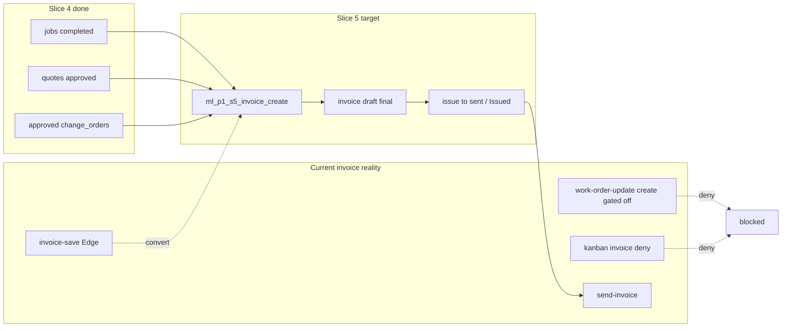

# ML-P1 Slice 5 — Architecture Findings (Invoice) — revalidated

| Field | Value |
| --- | --- |
| Planning base | `e9cc3317fcb9c84f44643700927699f40c7f1a93` |
| Revalidated | 2026-07-23 |
| Live invoices | 25 · `draft`/`sent`/`paid` · unique-job indexes present |
| S4 gate | Invoice-on-complete **disabled** in source |
| PD status | PD-S5-01…07 **RATIFIED** |

## System picture

## Findings (still true on current main + live)

1. **No S5 canonical create RPC** on main — closest writer remains Edge `invoice-save`.
2. **One-invoice-per-job indexes** present live (`idx_invoices_unique_job`, active/draft-type uniques).
3. **Parallel creators remain dangerous if re-enabled:** work-order ensure, kanban getOrCreate, quote-accept auto-draft flag, MyMoney/direct inserts.
4. **S4 correctly disables** complete→invoice create; kanban denies invoice path.
5. **Settlement writers** are S5b — S5 must not own Stripe/offline payment authority; may read settlement.
6. **Lineage incomplete** on live invoices — job/quote ids present; frozen quote version + CO id set + calc snapshot still to be designed in coding (grandfather PD-S5-07).
7. **Status vocabulary live-simple:** `draft`/`sent`/`paid` — PD-S5-02 keeps `sent`, display “Issued”.
8. **tenant_id** remains storage; authz follows single-company role model (not multi-tenant).
9. **Price-book on main** now includes HCP catalog — **forbidden** as silent recalculation source at invoice create/issue (PD-S5-04).

## Boundary

| In S5 | Out |
| --- | --- |
| Canonical create from completed job + quote + approved COs | Stripe initiate/webhook/refunds |
| Draft review, issue/send, void | Autonomous unpaid follow-up |
| Tax from quote snapshot + draft correct | Pricebook reprice of issued |
| Customer invoice view (read) | TIS / G2.3 / multi-tenant redesign |
