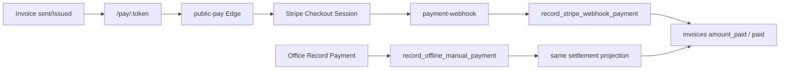

# ML-P1 Slice 6 — Architecture Findings (Stripe settlement)

| Field | Value |
| --- | --- |
| Evidence date | 2026-07-23 |
| Main SHA | `a7e1f63781cca7fcba5d706a7a97bd62a17a4c3b` |
| Project | `wwyxohjnyqnegzbxtuxs` |
| Class | Planning / architecture (EXECUTED live reads; no mutations) |

## Naming reconciliation

| Historical roadmap | This packet (Founder-aligned) |
| --- | --- |
| S5b Stripe payment operations | **S6** Stripe settlement & payment posting |
| S6 autonomous follow-up | **S7** (deferred) |

Do not open branch `ml/p1-s5b-*` for this work; use `ml/p1-s6-stripe-settlement` (coding, later).

## Live posture (EXECUTED)

| Fact | Value |
| --- | --- |
| `global_config.payments_mode` | `stripe` |
| Invoices | 25 total · `amount_paid>0` = 10 · `provider_payment_id` set = 9 · `status=paid` = 9 |
| Tables present | `stripe_webhook_events`, `public_payment_attempts` |
| S5 invoice create | Live (canonical RPCs); issue persists `sent` / display Issued |

## Existing spine (SOURCE)

| Component | Role | Gap |
| --- | --- | --- |
| `public-pay` | Creates Checkout (`mode: payment`, card) | Immediate capture only; no auth-hold product |
| `payment-webhook` / `stripe-webhook` | Settles via RPC; signed | Refunds/disputes ignored today |
| `record_offline_manual_payment` | Cash/check posting | Must remain under G-09 |
| `send-invoice` | Pay link + optional hosted Stripe Invoice | Dual initiation surface risk |
| `create-payment-intent/` | CORS stub only | Not a product path |
| Client Stripe.js / Elements | Absent | Good for PCI minimization |

## Secrets / linkage (names only)

- Env: `STRIPE_SECRET_KEY`, `STRIPE_WEBHOOK_SECRET`, `PUBLIC_PAY_BASE_URL`
- No `VITE_STRIPE_*` (correct for hosted Checkout)
- Stripe Customer created/listed by email in `send-invoice` — no durable CRM `stripe_customer_id` column in use
- Single-account (no Connect) matches TVG single-tenant

## Money-state interaction with S5

| S5 | S6 |
| --- | --- |
| Creates/issues/voids invoices | Does not create invoices |
| Freezes financials on `sent` | Settles `amount_paid` / status via paid writers only |
| Void unpaid | Refund after paid (new) does not “unvoid”; uses refund + status rules |
| Never auto-send | Never auto-charge |

## Risks

1. **G-09 incomplete** — alternate paid paths (UI direct status update, hosted Invoice side effects) must be inventory + deny.  
2. **Dual initiation** — Checkout Session vs optional Stripe Invoice objects.  
3. **Job vs invoice payment_status** (KI-06) still divergence-prone.  
4. **Partial pay** supported in contracts but weakly exercised live.  
5. **Refund ignore** in webhook leaves Stripe refunds desynced from CRM.  
6. **PCI creep** if Elements/Terminal introduced without Major Decision.

## Recommended architecture target (pending PD ratification)

- Keep hosted Checkout as sole card collection UX.  
- Canonical writers only: Stripe webhook RPC + offline manual RPC (+ optional explicit refund RPC calling Stripe then ledger).  
- Quarantine tasks for disputes / unmatched events.  
- No SetupIntent vault; no auto-charge; no Connect.
