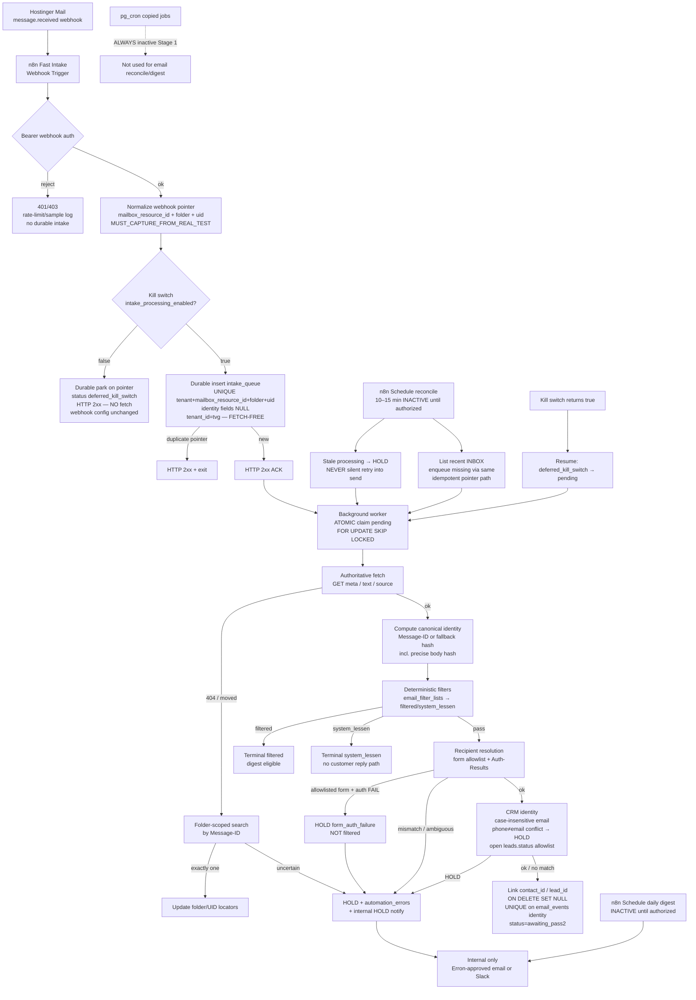

# 01 — Architecture (Pass 1 v5)

**Status:** DESIGN REVIEW ONLY — design only  
**Stage:** Stage 1 — REVIEW ONLY (no customer-facing sends)  
**Supersedes:** `pass1-v4/01-architecture.md` (contacts/leads RLS; form-auth HOLD; atomic claim; split gates; bootstrap order)

---

## 1. Phase boundary

| Phase | Scope |
|-------|-------|
| **Pass 1 (this pack)** | Intake + identity + routing + logging + recovery |
| **Pass 2 (separate)** | AI classification + knowledge grounding + drafting + validation + human review |

Pass 1 stops at durable SoT rows (`filtered` / `system_lessen` / `held` / `awaiting_pass2`) plus internal ops signals. **No drafts. No `email_responses` / `email_send_queue`.**

---

## 2. System overview

Inbound mail for `info@vent-guys.com` arrives via Hostinger Mail webhooks. n8n performs a **fast, durable, fetch-free ACK** (auth + idempotent `intake_queue` write keyed on the webhook pointer), returns **2xx**, then a **background worker** **atomically claims** queue rows, fetches the authoritative message, computes canonical identity, applies deterministic filters and recipient/CRM resolution, and writes SoT rows under the **private** schema `email_automation`. Every `email_automation` row carries **`tenant_id = 'tvg'`**. Cross-system IDs live in `integrations.external_references`.

A single operational **kill switch** (`intake_processing_enabled`) can stop worker/reconcile processing **without** changing Hostinger webhook configuration. Parked rows resume per §7 when the switch returns to true.

---

## 3. Stage 1 flow

### Fast-path contract

| Step | Must |
|------|------|
| Auth | Fail closed **before** durable write; rejected auth rate-limited / sampled |
| Kill switch | When `intake_processing_enabled=false`, park on pointer + 2xx; **no Hostinger fetch**; webhook config unchanged |
| Idempotency (queue) | Unique write on **webhook pointer** `(tenant_id, mailbox_resource_id, folder, uid)` **before** 2xx; identity nullable |
| Fetch | **Forbidden** on fast path |
| ACK | **2xx** after durable write (or documented park under kill switch — never 5xx retry storms) |
| Worker claim | **Atomic** `UPDATE … WHERE status='pending' … FOR UPDATE SKIP LOCKED RETURNING` (see `06`) |
| Worker | Fetch → compute Message-ID / fallback hash → enforce uniqueness on `email_events` |
| Form auth fail | Allowlisted form From + SPF/DKIM/DMARC fail → **HOLD** `form_auth_failure` — **never** `filtered` |
| Reconcile | n8n Schedule 10–15 min: stale → HOLD **and** list recent INBOX → enqueue gaps via same pointer path; schedule **inactive** until authorized |
| Stale recovery | Mid-processing past TTL → **HOLD** + review; **never** silently retry into any future send path |
| Kill-switch resume | When switch re-enabled: `deferred_kill_switch` → `pending` (see `06`); do not auto-unHOLD stale HOLDs |
| Digest | n8n Schedule daily; inactive until authorized; Erron-approved internal only |
| pg_cron | Copied production jobs stay **disabled** |

---

## 4. Explicit non-goals (Pass 1)

| Non-goal | Notes |
|----------|-------|
| AI classification / drafting | Pass 2 |
| Knowledge grounding for replies | Pass 2 |
| Response validation / human draft review | Pass 2 |
| `email_responses` / `email_send_queue` / customer sends | **Absent from Pass 1 schema** |
| HCP writes | Locked zero |
| Applying SQL / enabling Hostinger webhook | Requires **Pre-build** then **Pre-webhook** gates + Founder OK |
| Production secrets / production Edge Functions | Forbidden |
| Customer-address notifications | Forbidden — internal Erron-approved only |
| Active pg_cron for email | Disabled; use inactive n8n Schedules |
| Hard-coded filter lists in n8n | Use `email_filter_lists` table |
| Silently filtering form auth failures | Forbidden — must HOLD |

---

## 5. Component boundaries

| Component | Owns | Does not own |
|-----------|------|--------------|
| **Hostinger Mail** | Mailbox, webhooks, fetch/search/list | Business logic; kill switch lives in Supabase settings |
| **n8n fast intake** | Auth, pointer normalize, durable insert, 2xx, reject sampling, kill-switch park | **Any Hostinger fetch**; secrets in JSON |
| **n8n worker** | **Atomic claim**, fetch, identity, filter, resolve, CRM link, HOLD notify | Customer sends; drafts; knowledge-for-draft; non-atomic multi-claim |
| **n8n reconcile (Schedule)** | Stale → HOLD; INBOX list gap-fill enqueue; kill-switch resume reclaim | Live ACK; sends; pg_cron |
| **n8n daily digest (Schedule)** | Filtered summary to approved internal dest | Customer mail |
| **`email_automation` (private)** | Email SoT; all rows `tenant_id=tvg` | PUBLIC/anon/authenticated access |
| **CRM** | contacts/leads **SELECT** for identity (RLS policies required) | Email lifecycle; Pass 1 CRM writes |
| **`integrations.external_references`** | Cross-system ids (`entity_id` text) | Bodies |
| **`n8n_email_automation` role** | Least privilege + RLS policies | `service_role` |

---

## 6. Data model sketch

- `intake_queue` (pointer-keyed; identity nullable; documented status machine), `email_events` (identity uniqueness), `email_filter_lists`, `automation_settings`, `automation_errors`, `known_form_senders` (**empty seed**), `notification_log`
- **No** `email_responses` / `email_send_queue`
- CRM FKs `contact_id` / `lead_id` with **`ON DELETE SET NULL`** (real statements)
- Settings: `auto_send_enabled=false`, `intake_processing_enabled=true`, production-realistic `open_lead_statuses`, `hold_on_form_auth_failure=true`, notify destinations null until Erron sets+tests
- Schema **PRIVATE**: real REVOKE + GRANT; complete RLS on every touched table **including `public.contacts` / `public.leads`**
- Bootstrap order: see `11-bootstrap-order.md`

---

## 7. Kill switch + resume (summary)

| State | Fast path | Worker / reconcile |
|-------|-----------|-------------------|
| `intake_processing_enabled=false` | Durable park (`deferred_kill_switch`) + 2xx; no fetch | Skip processing |
| Switch returns `true` | Normal pointer inserts | **Resume:** set `intake_queue.status` from `deferred_kill_switch` → `pending`; worker processes. Stale **HOLD** rows stay HOLD until explicit ops action. |

Full rules: `06-n8n-intake-worker-reconcile.md` §2.

---

## 8. Queue terminal state machine (summary)

Full transition table: `06` §4.1.

| Status | Kind | Meaning |
|--------|------|---------|
| `pending` | active | Claimable by worker |
| `processing` | active (leased) | Claimed; lease via `locked_at` / `locked_by` |
| `deferred_kill_switch` | parked | Kill-switch park; resumes → `pending` |
| `done` | **terminal** | Successfully processed |
| `duplicate` | **terminal** | Duplicate of existing identity/event |
| `held` | **terminal until ops** | HOLD for human review |
| `error` | **terminal until ops** | Hard failure; no silent auto-retry into send |

---

## 9. Trust principles

1. Fail closed → HOLD + errors; never customer contact.
2. Webhook = pointer only; Hostinger GET = authoritative; fast path never fetches.
3. Folder/UID = locators; Message-ID / fallback hash = durable identity on `email_events`.
4. Case-insensitive email match; phone conflict when phone hits contact with different email → HOLD.
5. Form trust: empty allowlist until real samples; require Authentication-Results SPF+DKIM+DMARC pass; never treat as form solely because From is our mailbox.
6. **Form allowlisted + auth fail → HOLD** (`form_auth_failure`); never silently filter.
7. Registrable-domain compare uses a public-suffix list.
8. Stale processing → HOLD; never silent path into send.
9. Kill switch does not mutate Hostinger webhook config; resume is explicit and defined.
10. Internal notify destinations are Erron-approved only; set **and tested** before controlled testing (Pre-webhook gate).
11. Open-lead linking uses a **production-realistic allowlist** that excludes terminal statuses (e.g. `Customer`).

---

## 10. UNKNOWN / must-test

Mark as `MUST_CAPTURE_FROM_REAL_TEST`: webhook JSON paths (mailboxResourceId, folder, uid types), Bearer header exactness, folder encoding, folder-scoped search body, Authentication-Results header shape, Erron-approved notify destination binding + test send, production distinct `leads.status` value census (confirm open allowlist).
